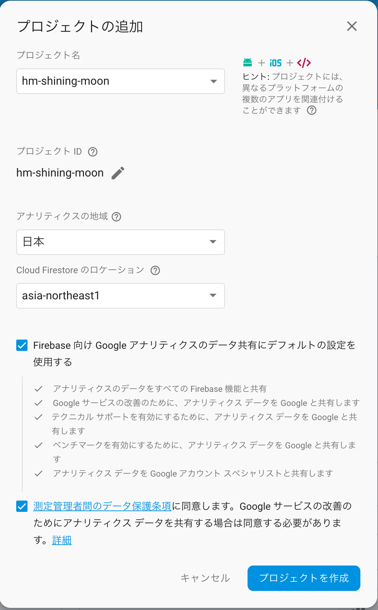
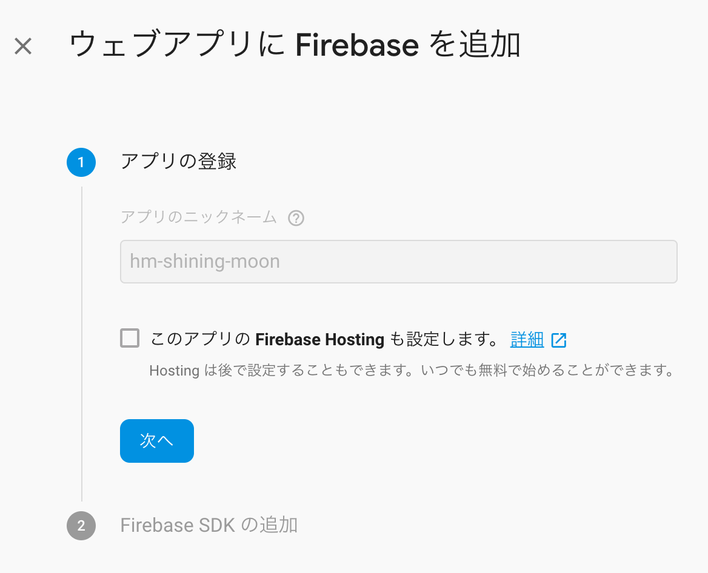

# Chapter1 Firebaseの基本を理解する

## 1-1 Firebase コンソール

【やったこと】

Firebaseプロジェクトを作る  
プロジェクト名は「hm-shining-moon」とした。

* 地域・ロケーションはデフォルトではなく、日本、asia-northeast に変更した
* チェックボックスは書籍にはもう一つ「アプリでFirebaseサービスを使用することに・・・」というのがあるが、このチェックボックスは無かった

## １-２ プロジェクトでのFirebaseの利用

### Webページでの利用（１） scriptタグで組み込む方法

【やったこと】

* Firebaseの現在の最新版は6.1.1
* P.24 「config変数の内容について」に記載されている内容、Firebaseコンソールで値を得るにある、画面を表示するところが少し違った
  * もう１ステップ増えてた。「アプリの登録」という画面が増えている
  
  * configのキーに「appId」というのが増えていた

[list1-1](./code/chapter1-list1-1.html) を実装。 
動作は問題なく確認取れた。  

【気になったこと】

`var` 使って変数初期化しているところが気になる。  
今どきは両方constでいいのでは？  

### Webページでの利用（2） Node.jsプロジェクトでのFirebaseの利用

【やったこと】

* [list1-2](./code/chapter1-nodejs/package.json) を実装
* バージョンは先程とおなじく、現在の最新、6.1.1
* `npm install` 叩く
* [list1-3](./code/chapter1-nodejs/index.js) を実装
* `npm run start` 叩く
* http://127.0.0.1:3000/ にアクセスして動作確認

【気になったこと】

* list1-3、`var`使ったり`const`使ったり、`let`使ったりで、統一感が無い。。。
* 文字列リテラルもシングルクォートだったりダブルクォートだったり、バッククオートだったり、＋で文字列連結してたり、統一感ナッシング。
* プログラム中ではホスト名を `127.0.0.1` としてるのに、説明文中では `localhost` と書いていて、読者混乱するのでは。
