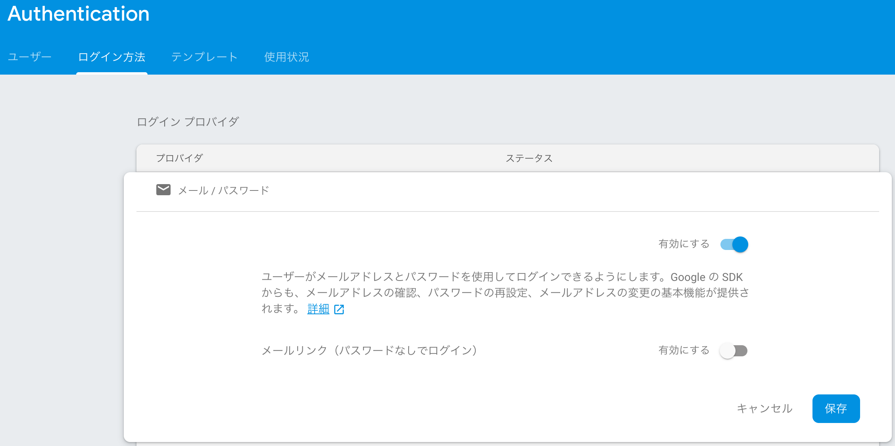
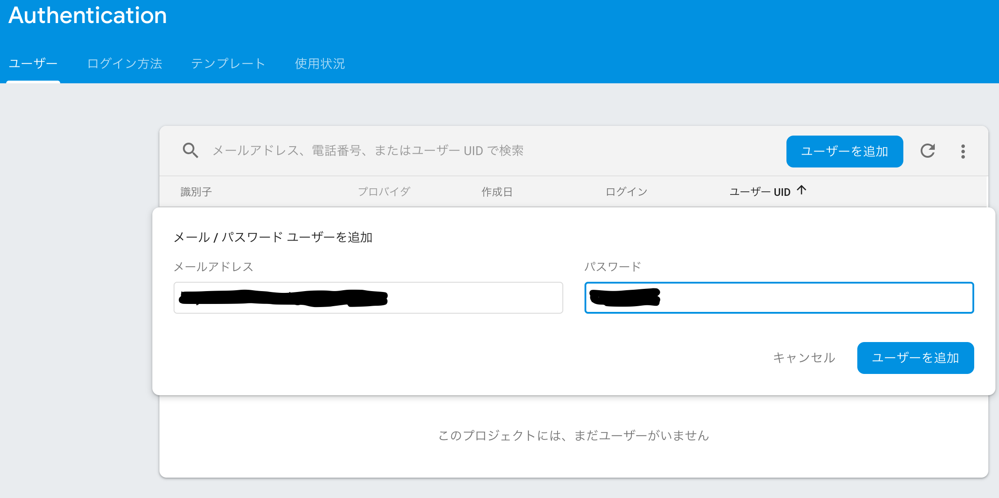

# Chapter2 Authentication

## 2-1 Authentication の設定

ここは説明だけなので、ひたすら読むだけ。

P53、Googleの設定中に「プロジェクトのサポートメール」に「自身の使っているメールアドレスを入力します」というのは少々誤解を招きそうな気がする。  
たぶんこのプロジェクトの問い合わせ先となるメアドを入れるべきなんだろう。  
個人ユースならこの説明でいいのかもしれないが。  
いずれにせよ、今は使う予定がないのでスルー。

# 2-2 WebアプリでのAuthenticationの利用

Firebaseプロジェクトで、ログインプロバイダの「メール・パスワード」を有効にする  


ユーザを追加  


スクリプトを作成  
[list2-1](./code/chapter2-list2-1.html)

動作テストし、問題なくログイン・ログアウトできたことを確認。

P73に、
```
このスクリプトはHTMLファイルをWebブラウザで直接開いて表示するのではなく
Webサーバにアクセスして実行するようにしてください。
Firebaseの機能の多くは、ローカルファイルを開いた状態ではうまく動きません。
```

とあるが、少なくともこのスクリプトは問題なく動いた。   
今後のサンプルでは動かないケースがでてくるのだろうか。 

P74の上から２つめのソースコード部分にtypoがある。。。

※ メール/パスワード以外のログインプロバイダは今回スキップ。

※ 2-3, 2-4 はアプリの記述なので、今回はスキップ