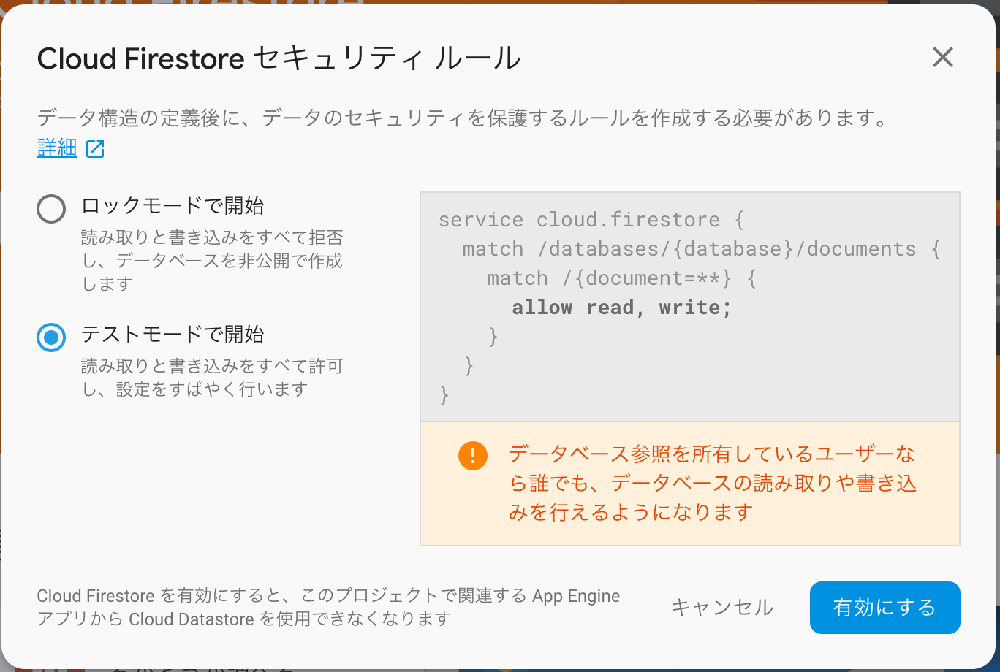
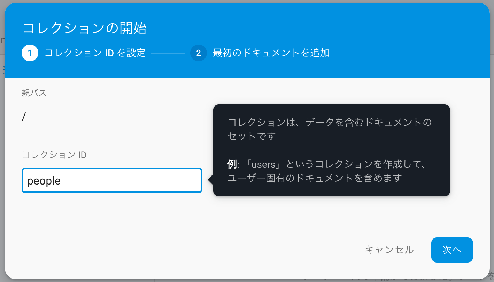
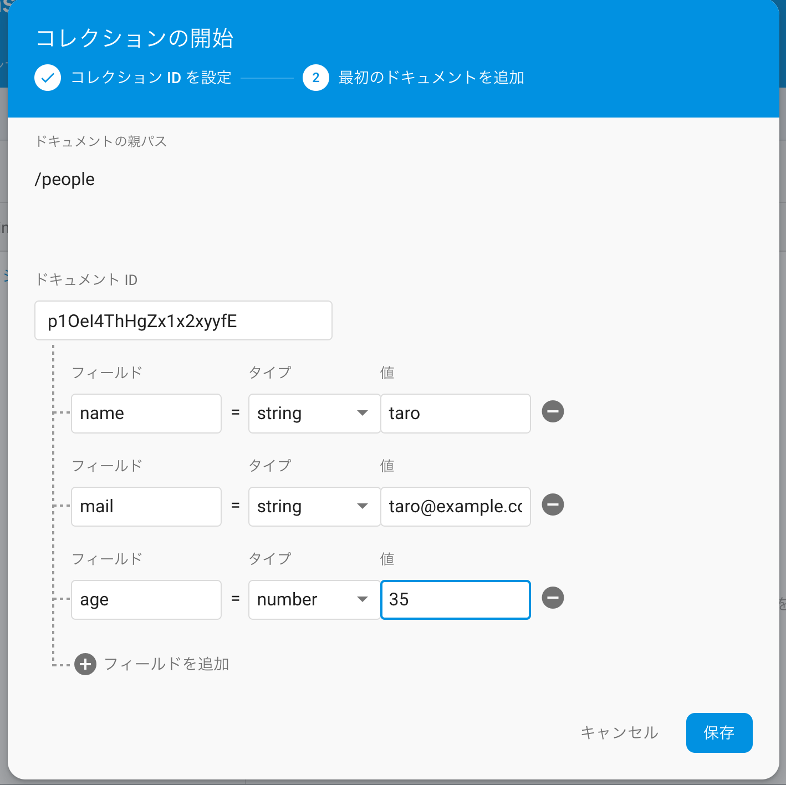
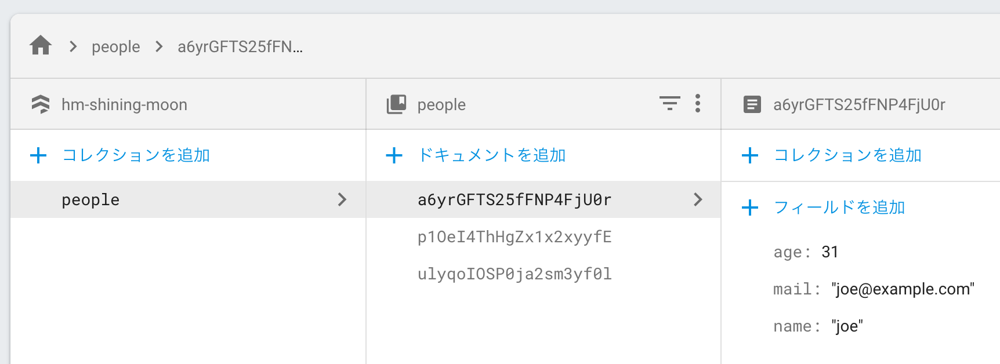
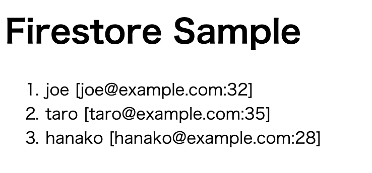
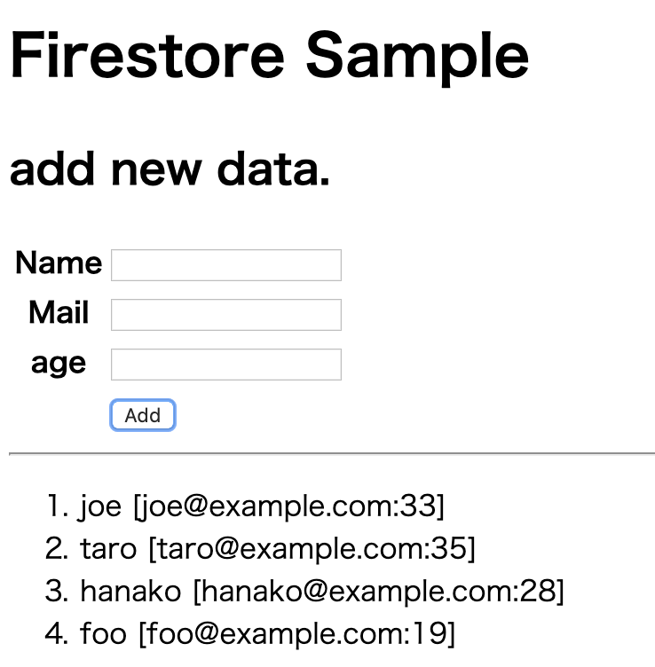

# Chapter4 Cloud Firestore 

※Chapter3 Realtime Database は当面使う予定ないのでスキップ

## 4-1 Cloud Firestore の設定

* Realtime Databaseとの違い（Realtime Databaseの制限）
  * Realtime Databaseはデータベースが１つしか持てない
    * ここでいう「Database」は、RDBでいうテーブルのことか？
  * スケーラビリティの上限
    * 同時接続約10万、毎秒1000回の書き込み
    * それ以上必要ならシャーディングが必要
* Cloud Firestoreは、Firebase組み込み機能ではなく、GCPの機能がFirebaseでも使えるようになったもの
* Cloud Firestoreの特徴
  * ドキュメントベース
  * 複数データベース（コレクションと呼ぶ）
  * スケーラビリティ

### Cloud Firestoreを利用する

Firebaseコンソールから。

「データベースの作成」押下

Cloud Firestore セキュリティルールのダイアログ。  
「テストモードで開始」を選択、「有効にする」を押下。

Cloud Firestore の構造は  
コレクション > ドキュメント > フィールド

ドキュメントの中にコレクションを追加することもできる。

### データベースを構築する

「コレクションの開始」から、コレクションIDに「people」と入力し、次へ。

「コレクションの開始」にて

* ドキュメントIDの「自動ID」を押下。IDが発行される。
* name, mail, age フィールドを作り、「保存」
  * mail フィールドに保存するサンプルの文字列、書籍のあんま良くないと思う。

さらにいくつかドキュメントを追加する

* フィールドは「値」と「タイプ」は編集可能
* コレクションとドキュメントは（IDの）変更不可。必要なら削除して作り直す

「ルール」「インデックス」「使用状況」のところは本読んで理解した。

## 4-2 WebからのCloud Firestoreの利用

### コレクションのドキュメント一覧を表示する

[list4-5](./code/chapter4-list4-5.html)

### リアルタイム更新

[list4-6](./code/chapter4-list4-6.html)

ブラウザで表示した後、DBを更新して、ブラウザをリロードせずに反映していることを確認。

P253の説明  
「getをonSnapshotに書き換えただけ」とあるけど  
厳密には、「get/thenをonSnapshotに書き換えただけ」のはず。  
最初はリスト4-6の方が誤植？かと思ってしまった。  
コードはこれであっているようなので、この説明が紛らわしい。

### データの新規作成

[list4-7](./code/chapter4-list4-7.html)

list4-7, 変数の命名規則がひどい…  
入門者向けだからこそ、命名規則とかしっかりして欲しいものだが…

### データの更新

[list4-8](./code/chapter4-list4-8.html)

相変わらずコードのカオスっぷりはすごい。。。  
とりあえず、bodyタグにonlaod設定忘れてて動かなくて焦った。  
（コピペで進めてて見落としてた）

### データの削除

[list4-9](./code/chapter4-list4-9.html)

ここはとくにハマりポイントは無し。

### データの検索

[list4-10](./code/chapter4-list4-10.html)

where 複数

[list4-11](./code/chapter4-list4-11.html)

前方一致

[list4-12](./code/chapter4-list4-12.html)

突然でてくる「\uf8ff」って何者だよ？？
説明入れてくれ。。。

### 複数whereのルール

ここから突然説明が雑になる印象。。。サンプルソースもないし。

* 比較は複数フィールドは不可
* 等号と比較を別のフィールドで適用する場合、複合インデックスの作成が必須

### 並べ替えと取得数

* コレクションに対し、 `.orderBy()` と `.limit()` が使える。

※ 4-3、4-4 は Android/iOSの内容なのでスキップ。

