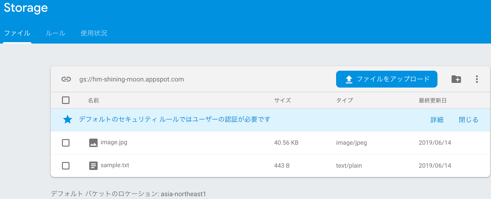
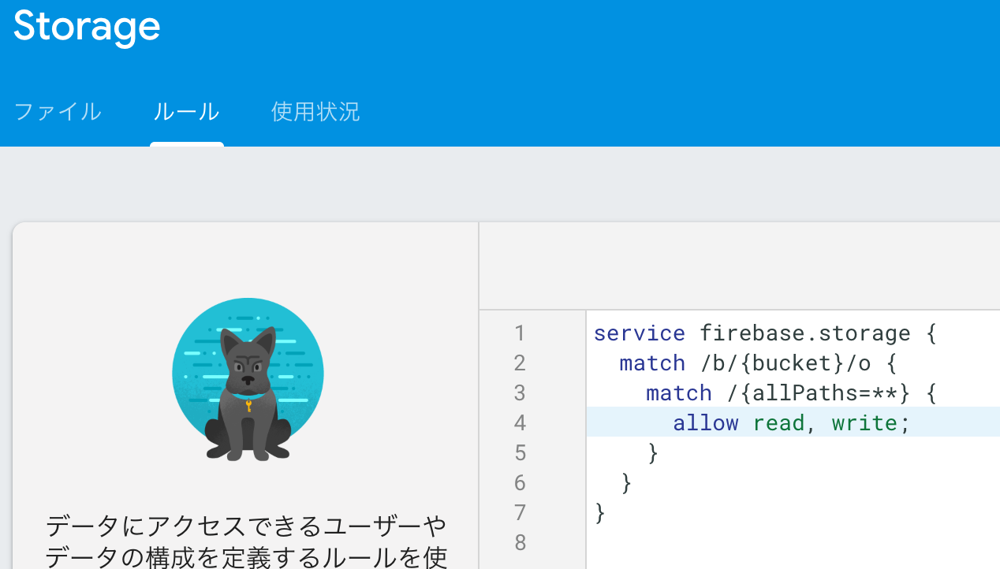

# Chapter5 Storage

## 5-1 Storage の設定

* 左メニューから「Storage」を選んで、「スタートガイド」
* セキュリティルールのダイアログ。ここは確認だけ。OK押す。
* テキストファイル、画像ファイルを準備
* Firabaseコンソールから「ファイルをアップロード」でアップ（複数一気にいける）



### セキュリティルールについて

デフォルトは認証ユーザのみアクセスできるルール。

ここでは、検証のため、認証なしでアクセスできるように修正。



### CORSの制限を外す

[cors.json](./code/chapter5/cors.json)

`gcloud init` はすでに別件でセットアップ済なのでスキップ。

```
$ gsutil cors set cors.json gs://hm-shining-moon.appspot.com


Updates are available for some Cloud SDK components.  To install them,
please run:
  $ gcloud components update

Setting CORS on gs://hm-shining-moon.appspot.com/...
```

## 5-2 StorageのWebからの利用

以下のファイルは、直接ブラウザで開いても動作しない。  
ローカルでWebサーバ起動して、見るようにする。  

PHPのビルトインサーバ使うのが楽。  
先のCORSファイルと、ホスト名、ポート番号を合わせるようにしておく。

```
$ php -S localhost:8888
```

テキストデータ

[chapter5-list5-5.html](./code/chapter5/chapter5-list5-5.html)

イメージデータ

[chapter5-list5-6.html](./code/chapter5/chapter5-list5-6.html)

アップロード

`putString()` は、すでにファイルがあると上書きするので注意

[chapter5-list5-7.html](./code/chapter5/chapter5-list5-7.html)

削除

[chapter5-list5-8.html](./code/chapter5/chapter5-list5-8.html)

メタデータ

[chapter5-list5-9.html](./code/chapter5/chapter5-list5-9.html)

※ 5-3、5-4 は Android/iOSの内容なのでスキップ。

