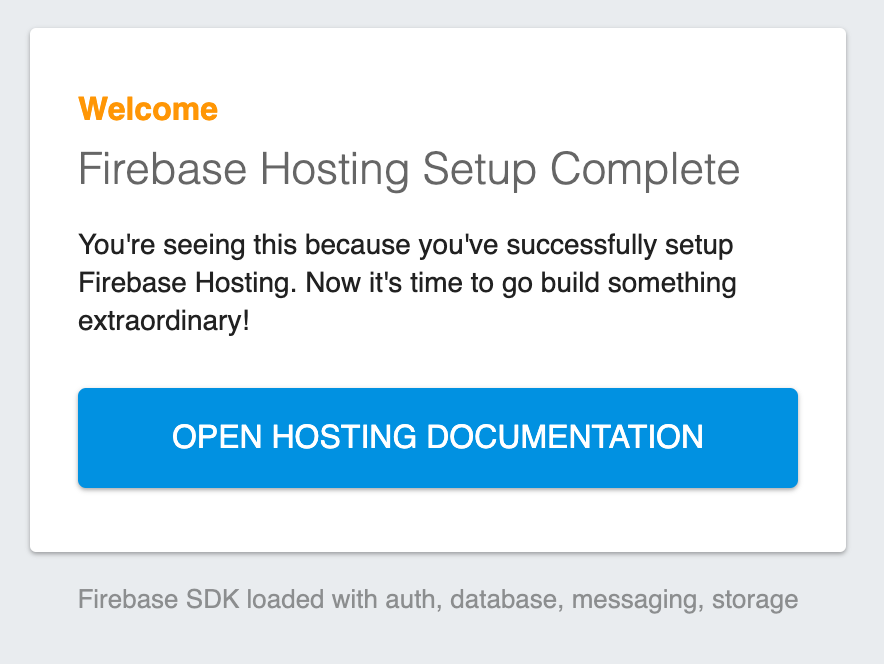
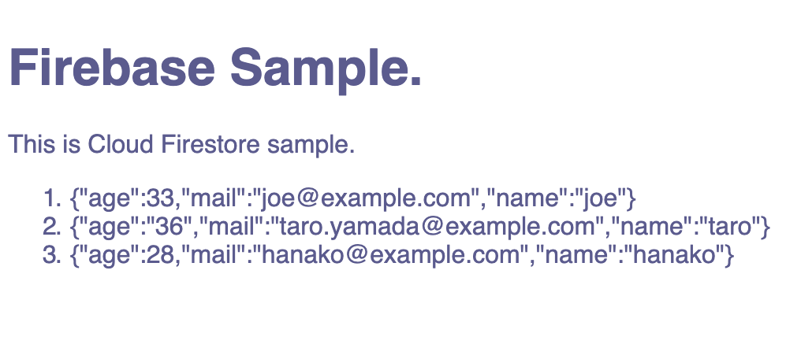

# Chapter6 Hosting および Cloud Functions

## 6-1 Hosting の利用

`firebase-tools` の準備のところは別件ですでにインストール済みなので、スキップ。

Firebase へのログイン

```
$ firebase login
Already logged in as ******@*****.***
```

別件でログイン済だった。

### Webサイトを作成する

```
$ cd /path/to/some/dir
$ firebase init

     ######## #### ########  ######## ########     ###     ######  ########
     ##        ##  ##     ## ##       ##     ##  ##   ##  ##       ##
     ######    ##  ########  ######   ########  #########  ######  ######
     ##        ##  ##    ##  ##       ##     ## ##     ##       ## ##
     ##       #### ##     ## ######## ########  ##     ##  ######  ########

You're about to initialize a Firebase project in this directory:

  /Users/d170070/personal-projects/hm-shining-moon/chapter6

? Which Firebase CLI features do you want to set up for this folder? Press Space
 to select features, then Enter to confirm your choices. (Press <space> to selec
t)
❯◯ Database: Deploy Firebase Realtime Database Rules
 ◯ Firestore: Deploy rules and create indexes for Firestore
 ◯ Functions: Configure and deploy Cloud Functions
 ◯ Hosting: Configure and deploy Firebase Hosting sites
 ◯ Storage: Deploy Cloud Storage security rules
```

「①初期化処理の開始」は表示されなかった。②がいきなりでるように仕様変わったのか。

本の指示どおり、すべてにチェック入れてEnterで先へ進む

```
? Which Firebase CLI features do you want to set up for this folder? Press Space to select features, then Enter to co
nfirm your choices. Database: Deploy Firebase Realtime Database Rules, Firestore: Deploy rules and create indexes for
 Firestore, Functions: Configure and deploy Cloud Functions, Hosting: Configure and deploy Firebase Hosting sites, St
orage: Deploy Cloud Storage security rules

=== Project Setup

First, let's associate this project directory with a Firebase project.
You can create multiple project aliases by running firebase use --add, 
but for now we'll just set up a default project.

? Select a default Firebase project for this directory: (Use arrow keys)
❯ [don't setup a default project] 
  ************ (*********) 
  ************ (*********) 
  ************ (*********) 
  ************ (*********) 
  hm-shining-moon (hm-shining-moon) 
  [create a new project] 
```

今回の写経用に用意したプロジェクトを選択。

```
? Select a default Firebase project for this directory: hm-shining-moon (hm-shining-moon)
i  Using project hm-shining-moon (hm-shining-moon)

=== Database Setup

Firebase Realtime Database Rules allow you to define how your data should be
structured and when your data can be read from and written to.

? What file should be used for Database Rules? (database.rules.json) 
```

ここはデフォルトのままでよいとのことなので、そのままEnter

```
? What file should be used for Database Rules? database.rules.json
✔  Database Rules for hm-shining-moon have been downloaded to database.rules.json.
Future modifications to database.rules.json will update Database Rules when you run
firebase deploy.

=== Firestore Setup

Firestore Security Rules allow you to define how and when to allow
requests. You can keep these rules in your project directory
and publish them with firebase deploy.

? What file should be used for Firestore Rules? (firestore.rules) 
```

ここもそのままEnter

```
? What file should be used for Firestore Rules? firestore.rules

Firestore indexes allow you to perform complex queries while
maintaining performance that scales with the size of the result
set. You can keep index definitions in your project directory
and publish them with firebase deploy.

? What file should be used for Firestore indexes? (firestore.indexes.json) 
```

ここもそのままEnter

```
? What file should be used for Firestore indexes? firestore.indexes.json

=== Functions Setup

A functions directory will be created in your project with a Node.js
package pre-configured. Functions can be deployed with firebase deploy.

? What language would you like to use to write Cloud Functions? (Use arrow keys)
❯ JavaScript 
  TypeScript 
```

書籍通り、JavaScriptを選択

```
? What language would you like to use to write Cloud Functions? JavaScript
? Do you want to use ESLint to catch probable bugs and enforce style? (y/N) 
```

書籍どおり、Nを選択

```
? Do you want to use ESLint to catch probable bugs and enforce style? No
✔  Wrote functions/package.json
✔  Wrote functions/index.js
✔  Wrote functions/.gitignore
? Do you want to install dependencies with npm now? (Y/n) 
```

「Y」を選択してインストール開始

```
? Do you want to install dependencies with npm now? Yes

> grpc@1.21.1 install /path/to/hm-shining-moon/chapter6/functions/node_modules/grpc
> node-pre-gyp install --fallback-to-build --library=static_library

node-pre-gyp WARN Using needle for node-pre-gyp https download 
[grpc] Success: "/path/to/hm-shining-moon/chapter6/functions/node_modules/grpc/src/node/extension_binary/node-v57-darwin-x64-unknown/grpc_node.node" is installed via remote

> protobufjs@6.8.8 postinstall /path/to/hm-shining-moon/chapter6/functions/node_modules/protobufjs
> node scripts/postinstall


> firebase-functions@2.3.1 postinstall /path/to/hm-shining-moon/chapter6/functions/node_modules/firebase-functions
> node ./upgrade-warning


======== WARNING! ========

This upgrade of firebase-functions contains breaking changes if you are upgrading from a version below v1.0.0.

To see a complete list of these breaking changes, please go to:

https://firebase.google.com/docs/functions/beta-v1-diff

npm notice created a lockfile as package-lock.json. You should commit this file.
added 328 packages in 17.272s

=== Hosting Setup

Your public directory is the folder (relative to your project directory) that
will contain Hosting assets to be uploaded with firebase deploy. If you
have a build process for your assets, use your build's output directory.

? What do you want to use as your public directory? (public) 
```

デフォルトでいいのでそのままEnter

```
? What do you want to use as your public directory? public
? Configure as a single-page app (rewrite all urls to /index.html)? (y/N)
```

デフォルトはN、なのでそのままEnter

```
? Configure as a single-page app (rewrite all urls to /index.html)? No
✔  Wrote public/404.html
✔  Wrote public/index.html

=== Storage Setup

Firebase Storage Security Rules allow you to define how and when to allow
uploads and downloads. You can keep these rules in your project directory
and publish them with firebase deploy.

? What file should be used for Storage Rules? (storage.rules) 
```

これもデフォルトのままでOK。Enter押す

```
? What file should be used for Storage Rules? storage.rules

i  Writing configuration info to firebase.json...
i  Writing project information to .firebaserc...
i  Writing gitignore file to .gitignore...

✔  Firebase initialization complete!
```

設定完了した。

ディレクトリの内容を確認。

```
$ ls -al
total 56
drwxr-xr-x  11    352  6 14 18:12 .
drwxr-xr-x  16    512  6 14 17:51 ..
-rw-r--r--   1     57  6 14 18:12 .firebaserc
-rw-r--r--   1   1144  6 14 18:12 .gitignore
-rw-r--r--   1    161  6 14 18:03 database.rules.json
-rw-r--r--   1    333  6 14 18:12 firebase.json
-rw-r--r--   1     44  6 14 18:04 firestore.indexes.json
-rw-r--r--   1    131  6 14 18:03 firestore.rules
drwxr-xr-x   7    224  6 14 18:07 functions
drwxr-xr-x   4    128  6 14 18:10 public
-rw-r--r--   1    138  6 14 18:12 storage.rules
```
※都合によりユーザ名/グループ名は意図的に消した

書籍とくらべると「.firebase」フォルダが書籍には書いてあるが、実際は作られていない。  
ここの理由は不明。

### Webサイトをデプロイする

```
$ firebase deploy
⚠  functions: package.json indicates an outdated version of firebase-functions.
 Please upgrade using npm install --save firebase-functions@latest in your functions directory.

=== Deploying to 'hm-shining-moon'...

i  deploying database, storage, firestore, functions, hosting
i  database: checking rules syntax...
✔  database: rules syntax for database hm-shining-moon is valid
i  storage: checking storage.rules for compilation errors...
✔  storage: rules file storage.rules compiled successfully
i  firestore: checking firestore.rules for compilation errors...
i  firestore: reading indexes from firestore.indexes.json...
✔  firestore: rules file firestore.rules compiled successfully
i  functions: ensuring necessary APIs are enabled...
✔  functions: all necessary APIs are enabled
i  storage: uploading rules storage.rules...
i  firestore: uploading rules firestore.rules...
✔  firestore: deployed indexes in firestore.indexes.json successfully
i  functions: preparing functions directory for uploading...
i  hosting[hm-shining-moon]: beginning deploy...
i  hosting[hm-shining-moon]: found 2 files in public
✔  hosting[hm-shining-moon]: file upload complete
i  database: releasing rules...
✔  database: rules for database hm-shining-moon released successfully
✔  storage: released rules storage.rules to firebase.storage/hm-shining-moon.appspot.com
✔  firestore: released rules firestore.rules to cloud.firestore
i  hosting[hm-shining-moon]: finalizing version...
✔  hosting[hm-shining-moon]: version finalized
i  hosting[hm-shining-moon]: releasing new version...
✔  hosting[hm-shining-moon]: release complete

✔  Deploy complete!

Please note that it can take up to 30 seconds for your updated functions to propagate.
Project Console: https://console.firebase.google.com/project/hm-shining-moon/overview
Hosting URL: https://hm-shining-moon.firebaseapp.com

```

Hosting URLにアクセス



サイトが表示された。

### WebページからFirebaseの機能を利用する

（あとでコードにリンク）

デプロイ

```
$ firebase deploy
⚠  functions: package.json indicates an outdated version of firebase-functions.
 Please upgrade using npm install --save firebase-functions@latest in your functions directory.

=== Deploying to 'hm-shining-moon'...

i  deploying database, storage, firestore, functions, hosting
i  database: checking rules syntax...
✔  database: rules syntax for database hm-shining-moon is valid
i  storage: checking storage.rules for compilation errors...
✔  storage: rules file storage.rules compiled successfully
i  firestore: checking firestore.rules for compilation errors...
i  firestore: reading indexes from firestore.indexes.json...
✔  firestore: rules file firestore.rules compiled successfully
i  functions: ensuring necessary APIs are enabled...
✔  functions: all necessary APIs are enabled
i  storage: uploading rules storage.rules...
i  firestore: uploading rules firestore.rules...
✔  firestore: deployed indexes in firestore.indexes.json successfully
i  functions: preparing functions directory for uploading...
i  hosting[hm-shining-moon]: beginning deploy...
i  hosting[hm-shining-moon]: found 3 files in public
✔  hosting[hm-shining-moon]: file upload complete
i  database: releasing rules...
✔  database: rules for database hm-shining-moon released successfully
✔  storage: released rules storage.rules to firebase.storage/hm-shining-moon.appspot.com
✔  firestore: released rules firestore.rules to cloud.firestore
i  hosting[hm-shining-moon]: finalizing version...
✔  hosting[hm-shining-moon]: version finalized
i  hosting[hm-shining-moon]: releasing new version...
✔  hosting[hm-shining-moon]: release complete

✔  Deploy complete!

```

ブラウザで表示




